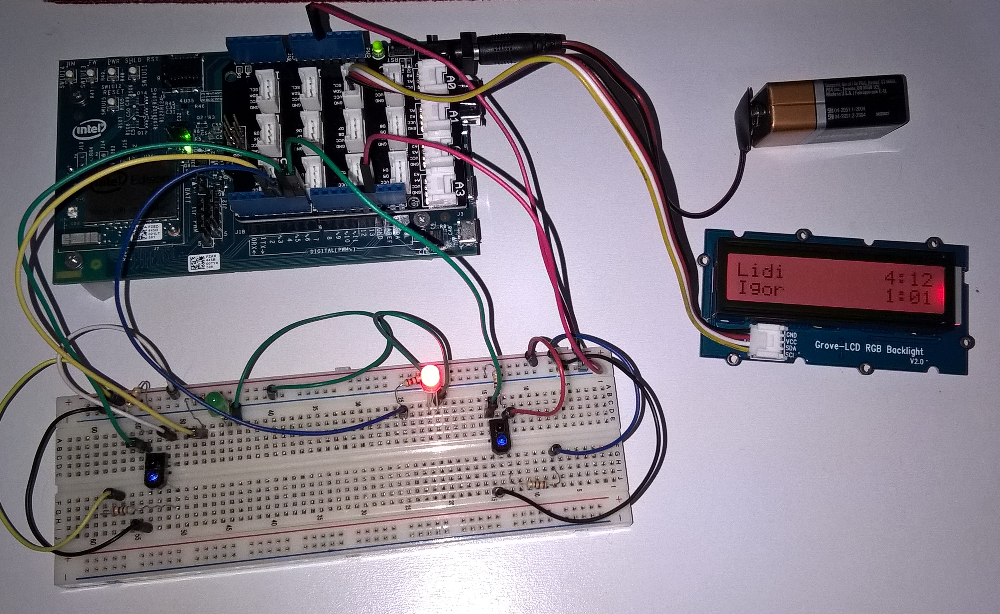

# Chess Clock

This is the application for a simple chess clock that I made using the Intel Edison kit for Arduino. Its sensors capture moves from two players and keep track of time for both. By the time one of them reaches the specified limit, it stops running and sends the result to the cloud using the [ThingSpeak](https://thingspeak.com/) api.

Then, ThingSpeak lets you setup what to do with that data. In my case, I chose to link it to my Twitter account and defined two different messages to be sent dependending on the result of the game.

Components used:
  - Intel Edison module
  - Arduino expansion board
  - Base shield (Grove Starter Kit - from seeedstudio)
  - Two leds
  - Two 220 ohm resistors (one for each led)
  - RGB Backlight LCD (Just because I found quite exciting to play with different colors for each moment of the game! XD)
  - Two Reflective Optical Sensors (You can use buttons as well... I just happen to like sensors the most ^^)
  - Two 10 khoms resistors (one for each sensor)
  - A couple of jumper cables
  
  Hardware setup:
  